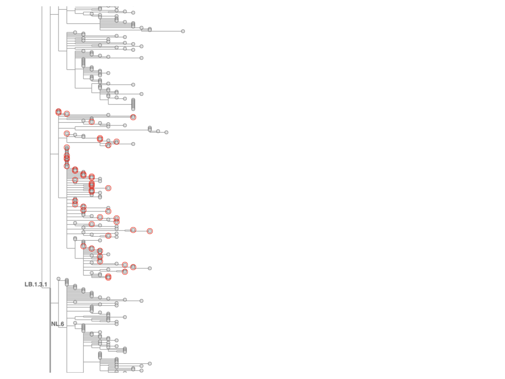
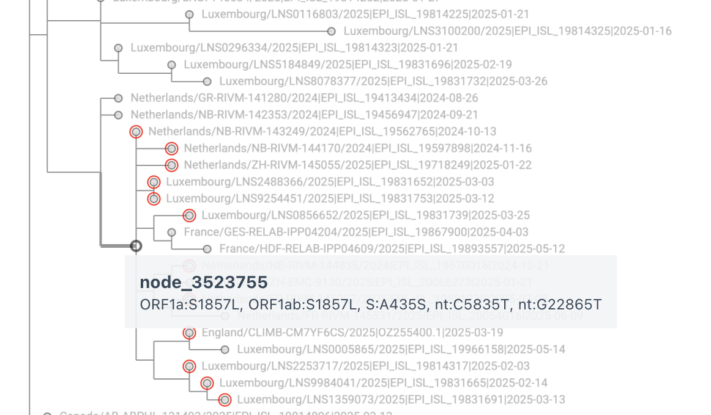
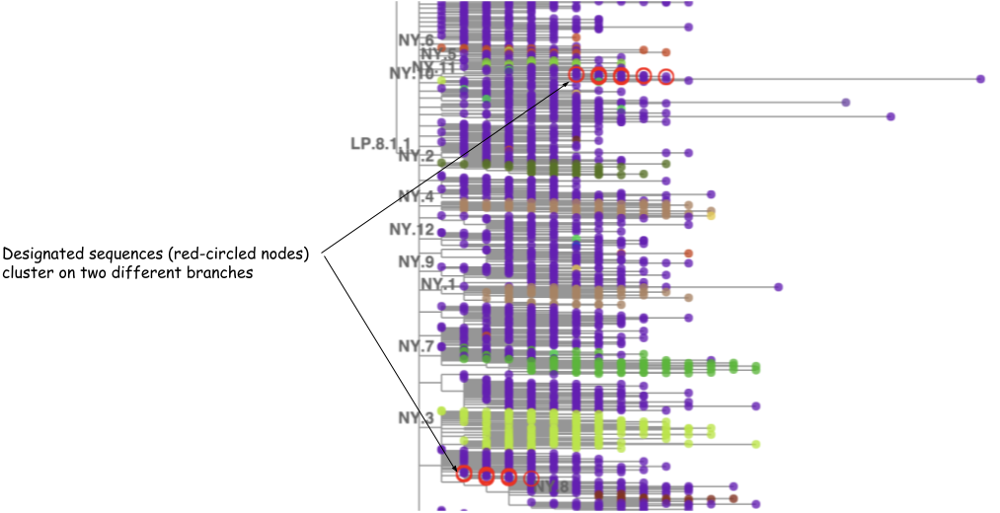

# Annotating clades/lineages on a daily-updated tree

As the tree grows, so does the Pango lineage system, and new lineages must be added to the set of
annotated lineages on the tree while existing lineages must be maintained as the tree changes
from day to day.  This section describes first the maintenance of existing lineages, a mostly
automated process using `matUtils annotate`, and then the addition of new lineages, a manual
process.

## How the daily build process maintains annotations

`matUtils annotate` has several different modes for annotating a lineage on a specific node of a
tree.  The fastest and surest option is `--clade-to-nid`, which takes a TSV input file that maps
clades/lineages to node IDs and applies the clade/lineage labels directly to the nodes.
However, every time a tree is modified, as it is in each daily update, all of the node
identifiers are subject to change.
Yesterday’s node identifiers do not apply to today’s tree.
So `--clade-to-nid` cannot be used in the daily build.
Instead, we use the mutations found in each lineage's branch in the tree to define the
clade/lineage and to identify the correct node in the updated tree to label as that
clade/lineage.

`matUtils annotate` has three options for describing the mutations that define clades/lineages,
and all three can be used simultaneously, applied in a hierarchical order from most specific
(and fastest) to least (and slowest).
If a clade/lineage is found by a more specific method, then it won’t be re-evaluated by a less
specific method.
The three options/methods are described here in the order in which they are applied in a single
run of `matUtils annotate`.

### Exact paths

Almost as fast as `--clade-to-nid`, but independent of node identifiers, is `--clade-paths`,
which takes a two-column TSV input file that maps clades/lineages to paths from root to
clade-branch, formatted like this:

```
B.13     > G29711T > A4838G,C7420T,C14937T,C20148T
```

Each node is represented by a comma-separated list of substitutions.
Nodes are separated by ` > `.
In the example above, the root node has no mutations, so the path begins with ` > `.

In the daily update process (specifically in
[`updateCombinedTree.sh`](../daily-pipeline/scripts.md#updatecombinedtreesh)),
today’s `matUtils annotate --clade-paths` input file is derived
from the output of running `matUtils extract --clade-paths` on yesterday’s tree.

Most clade/lineage paths remain the same from day to day, and can be followed through a tree
structure very quickly.
The bulk of lineage annotations are carried over in this way from day to day.
However, sometimes there are changes to some lineage paths: the order of mutations might be
swapped as matOptimize moves branches around, and/or nodes that have multiple mutations might be
split or merged.
In that case, the path as represented above no longer exists in the new tree, and the
appropriate node for the clade/lineage must be found some other way.

### Mutation sets

The `--clade-mutations` option is the next method by order of decreasing specificity,
and considerably slower than `--clade-paths`.
It accepts a TSV input file with the same format as `--clade-paths`, but with a less strict
interpretation: the ` > ` divisions are treated the same as commas, i.e. all mutations are
considered as an unordered set.
`matUtils annotate` then searches all nodes in the tree for the best match to that set of
mutations, which may include `N` bases to indicate that the mutation may be found on the path
to the clade/lineage but is not required.

The `--clade-paths` file can also use a previously defined lineage/clade at the beginning of a
mutation set to include all of that lineage/clade’s mutations.
For example, lineage XFY.1 includes all mutations found in lineage XFY plus three additional mutations:

```
XFY.1   XFY > A18077G > C4456T,A25067G
```

The daily update process uses manually edited files as `--clade-mutations` inputs for
Nextstrain clades and Pango lineages, respectively:
[nextstrain.clade-mutations.tsv](https://github.com/ucscGenomeBrowser/kent/blob/master/src/hg/utils/otto/sarscov2phylo/nextstrain.clade-mutations.tsv)
and 
[pango.clade-mutations.tsv](https://github.com/ucscGenomeBrowser/kent/blob/master/src/hg/utils/otto/sarscov2phylo/pango.clade-mutations.tsv).

### Representative sample mutations

The Pango organization does not define a lineage by a set of mutations.
Instead they define a lineage by a set of representative sequences.
The first implementation used to annotate lineages on an UShER tree was the slowest of the
three methods, `--clade-names`, which takes a TSV input file mapping clade/lineage names and
representative sample names, which exactly match names found in the tree.
The set of mutations found in the set of representative samples is extracted
(influenced by options `--allele-frequency` and `mask-frequency`)
and then used to search all nodes in the tree for the best match to that set of mutations,
by the same method as in [Mutation sets](#mutation-sets) above.

In the daily update process, today’s `matUtils annotate --clade-names` input file is derived from
the output of running `matUtils summary --sample-clades` on yesterday’s tree.

### Historical note

In the early days of the Pango lineage effort, a phylogenetic tree constructed by COG-UK was used
to identify and designate new Pango lineages.
Differences between the COG-UK tree and UShER tree meant that many lineages had sets of
representative sequences that did not map neatly onto branches of the UShER tree,
so `matUtils annotate --clade-names` was developed with fairly loose defaults for
`--allele-frequency` and `--mask-frequency`.
(When matUtils is applied to other viruses, those parameters often need adjustment.)
During the era of the Delta variant, the Pango Designator at the time (Chris Ruis) began to use
the UShER tree to identify branches that should be designated as new lineages.
Due to this use of the UShER tree in the designation process, each new lineage mapped much more directly onto a specific branch of the UShER tree.
Around the same time, there were so many lineages that the `--clade-names` method became too slow
for the daily build, so the `--clade-mutations` method was developed and the hand-edited
pango.clade-mutations.tsv file was introduced.
This became the way in which each new lineage annotation was added to the tree.
In time, as thousands of new Pango lineages were designated, the `--clade-mutations` method was
also too slow, and the `--clade-paths` method was added.


## How to annotate a newly designated Pango lineage

After each new Pango lineage is designated, it must be added to the daily update process’s file
that defines lineages as a set of mutations,
[pango.clade-mutations.tsv](https://github.com/ucscGenomeBrowser/kent/blob/master/src/hg/utils/otto/sarscov2phylo/pango.clade-mutations.tsv).
This is done by using Taxonium to visually determine the node that corresponds to the
Designator’s intentions and adding its set of mutations to pango.clade-mutations.tsv.

### How a new Pango lineage is designated

The GitHub repository
[cov-lineages/pango-designation](https://github.com/cov-lineages/pango-designation)
file
[lineages.csv](https://github.com/cov-lineages/pango-designation/blob/master/lineages.csv)
is the authoritative definition of Pango lineages:
it lists representative sequences for each lineage.
The Designator adds a new lineage by adding lines to that file containing the isolate name
(no accession ID) of each representative, followed by a comma, followed by the lineage name.
For example, lineage XFM was designated by adding these five lines to lineages.csv:

```
South_Africa/NICD-R09631/2024,XFM
USA/NY-PRL-250311_82G03/2025,XFM
France/GES-RELAB-IPP03716/2025,XFM
Italy/TAA-PAB_SABES_4880006101/2025,XFM
Italy/TAA-PAB_SABES_4880006136/2025,XFM
```

The Designator also adds a note to the file
[lineage_notes.txt](https://github.com/cov-lineages/pango-designation/blob/master/lineage_notes.txt).
For a recombinant lineage, the parent lineages and breakpoints are usually mentioned.
For a non-recombinant lineage, usually one or more of the mutations that distinguish the new
lineage from its parent are listed.
Between the placement in the UShER tree of the representative sequences and the comment in
lineage_notes.txt, the intent of the Designator is usually clear enough to identify a specific
branch of the UShER tree.  

### Helpful `bash` functions

To automate the process of extracting names for new lineages from lineages.csv,
and converting them into reasonably sized sets of full names used in the tree for
Taxonium’s multiple-name search input, we have defined a couple of `bash` functions.

The function `linSamples` searches for lines of lineages.csv that contain representative
sequences for a given lineage, randomly chooses a subset if there are more than 50 using the
UCSC kent utility `randomLines`, removes some overly generic names that have too many matches
in the tree, strips some newlines from country names added by the COG-UK GISAID ingest pipeline
but not the UCSC pipeline, and finds full names used in the `$today` version of the UShER tree
for names in lineages.csv:

```bash
today=$(date +%F)
lineages=<path to pango-designation/lineages.csv>
ottoDir=<path to parent directory of daily updates>

function linSamples {
    local l=$1
    local count=$(grep -F ,$l $lineages | grep -E ,$l'$' | wc -l)
    if [[ $count -gt 50 ]]; then
        grep -F ,$l $lineages | grep -E ,$l'$' | randomLines stdin 50 stdout \
        | grep -v ^RNA | grep -v /RNA/ | grep -v Denmark/202 \
        | sed -re 's/^([A-Za-z]+)_/\1/g; s/^([A-Za-z]+)_/\1/g;'" s/'//;" \
        | cut -d, -f 1 | grep -Fwf - <(zcat $ottoDir/$today/samples.$today.gz)
    else
        grep -F ,$l $lineages | grep -E ,$l'$' \
        | grep -v ^RNA | grep -v /RNA/ | grep -v Denmark/202 \
        | sed -re 's/^([A-Za-z]+)_/\1/g; s/^([A-Za-z]+)_/\1/g;'" s/'//;" \
        | cut -d, -f 1 | grep -Fwf - <(zcat $ottoDir/$today/samples.$today.gz)
    fi
}
```

The bash function `findMissingLineages` identifies lineages from the Delta era and beyond
(alphabetically following AY) that are present in lineages.csv but not pango.clade-mutations.tsv,
and for each such (new) lineage, shows the corresponding lineage_notes.txt comment and calls
`linSamples` to show full tree names of representative sequences:

```bash
function findMissingLineages {
    local lineages=~angie/github/pango-designation/lineages.csv
    tail -n+2 $lineages | cut -d, -f 2 | uniq | grep -E '^(AY|[B-Z][A-Z])' \
    | sort -u \
        > $TMPDIR/designatedDoubleLetters
    cut -f 1 $scriptDir/pango.clade-mutations.tsv  \
    | grep -E '^(AY|[B-Z][A-Z])' | grep -v _ | sort -u \
        > $TMPDIR/cladeMutDoubleLetters
    local missingLineages=$(comm -23 $TMPDIR/designatedDoubleLetters \
                                $TMPDIR/cladeMutDoubleLetters)
    echo $missingLineages
    echo ""
    for l in $missingLineages; do
        echo $l
        grep ^$l$'\t' ~/github/pango-designation/lineage_notes.txt
        echo ""
        linSamples $l
        echo ""
        echo ""
        echo -n "Hit Return when ready for more..."
        read next
        echo ""
    done
}
```

While `findMissingLineages` is running interactively in one terminal, I use the function `pt`
(short for "path to") in another terminal to show the path of mutations to a sequence whose
name I have copied from Taxonium (a child of the node that I want to annotate as the new lineage).
`pt` searches for a given sequence name in a file generated by `matUtils extract --sample-paths`
and strips out node identifiers so that the path of mutations from root to the given sequence is
formatted as a series of comma-separated single-nucleotide substitutions at each node,
with nodes separated by ` > `:

```bash
samplePaths=<path to file from matUtils extract --sample-paths>

function pt {
    grep $1 $samplePaths | sed -re 's/node_[0-9]+:/> /g'
}
```

### Determining the branch that the Designator had in mind when updating lineages.csv

After the Designator adds new lineages to lineages.csv, we pull changes from the GitHub
cov-lineages/pango-designation repository to a local copy,
set our bash shell variable `today` to the date of the most recently completed update,
run `findMissingLineages`, and copy-paste each set of representative sequences into
Taxonium’s multi-name search input in order to find the appropriate branch for the new lineage.

In most cases, the copy-pasted representative sequence names for a new lineage resolve in
Taxonium’s search onto a branch that is more or less evenly covered by the sequences,
like the branch with the red circles below (which became NL.12):

<figure markdown="1">

<figcaption>
The red circles from Taxonium multi-name search show representative sequences of the newly defined lineage, clearly identifying the child branch that should be labeled as the new lineage.
</figcaption>
</figure>

When the branch is clearly identified like that, we can select a tip from the base of the
branch, copy part of its name
(usually the *country/isolate/year* part before the first `|`, the pipe characters mess up
shell commands when pasted),
and paste that as argument to our [handy function](#helpful-bash-functions) `pt`:

```bash
# pt USA/DE-CDC-LC1117678/2024
USA/DE-CDC-LC1117678/2024|PQ303022.1|2024-08-26 > C14408T > ... > A22896C > A21137G 
```

Look at the end of the path for the mutation(s) that distinguish the branch from its parent.
In this case, the parent lineage LB.1.3.1 is defined by `A22896C` and the child branch has only
one mutation relative to its parent, `A21137G`.
So we define the new lineage accordingly by adding this line to pango.clade-mutations.tsv:

```
NL.12	LB.1.3.1 > A21137G
```

#### When it's not so simple

The Designator’s intent for the lineage definition is not always perfectly captured by the set
of representative sequences.
For example, there may be several mutations that distinguish a new lineage’s representative
sequences from its parent lineage, but the Designator might only care about the Spike mutation,
not the entire set; this will be indicated by a note in the file lineage_notes.txt, for example:

```
NL.3.1  Alias of B.1.1.529.2.86.1.1.9.2.1.3.1.3.1, S:A435S
```

At the time of designation, it may be that the final node on the path to the branch 
has multiple mutations,
i.e. all designated sequences have multiple mutations that differentiate them from the
node's parent and we don't know the order in which those mutations occurred.
However, if sequences subsequently become available that have only the Spike mutation of
interest, implying that the other mutation(s) were added after the Spike mutation,
then the new lineage will need to be annotated on the node with the Spike mutation,
not considering the unmentioned mutation(s) as part of the definition.
We do that by including the nucleotide change for the mutation mentioned in lineage_notes.txt,
but modifying the unmentioned mutation(s) to have `N` as the new allele, for example changing
`C5835T` that we copy-pasted from the output of `pt` to `C5835N`:

```
NL.3.1	NL.3 > G28798A > C7279T,C8890T,C13019T > G22865T > C5835N
```

<figure markdown="1">

<figcaption>
The last node on the path to new lineage NL.3.1 has two mutations, C5835T and G22865T,
but lineage_notes.txt mentions only S:A435S (G22865T) not ORF1a:S1857L (C5835T).
Change C5835T to C5835N in the definition in pango.clade-mutations.tsv.
</figcaption>
</figure>

Sometimes, instead of clustering neatly on a branch that clearly corresponds to the new lineage,
the designated sequences may cluster on multiple branches like this:

<figure markdown="1">

<figcaption>
Instead of designated sequences resolving to a single branch, here they resolve to two very
different branches.
</figcaption>
</figure>

That can happen for several reasons:

1. The two branches should be joined in one branch, but somehow got split by partial sequences;
in this case, some selective pruning and reoptimization usually helps.
1. The Designator made a typo during designation and only one of the branches (a subset of
designated sequences) should have had its sequences designated to the new lineage, while the
rest may belong to some other newly defined lineage.  If some other lineage is described in
lineage_notes.txt but does not appear in lineages.csv, then compare its stated mutations to
the mutations on the “wrong” branch (the branch whose mutations do not match the first new
lineage’s description in lineage_notes.txt).  If the mutations match the other lineage’s
description, then update lineages.csv to correct the designated lineage for those sequences.
1. If, instead of two distinct branches, there are just a few out-of-place sequences, it may
be a case of multiple distinct sequences having the same isolate name (some labs reuse names,
some names from INSDC are missing from metadata).
Such names should be removed from the lineages.csv file because they don’t resolve to a unique
sequence.

### Adding a new non-recombinant lineage to pango.clade-mutations.tsv

Most new Pango lineages are direct descendants of single parent lineages, so they have the
mutations found in the parent lineage plus one or more additional mutations.  In this case,
adding a new child lineage to the pango.clade-mutations.tsv file is straightforward: add a new
line with the new child lineage name, a tab character, and the parent lineage’s name, followed
by the mutations that distinguish the child lineage from its parent.  The bash function `pt`
defined above is useful for getting the complete list of mutations in a representative sequence
from the lineage, and the child lineage’s mutations can be copied from that list and pasted
into pango.clade-mutations.tsv.

Occasionally, a child lineage may be distinguished from its parent by a reversion or a change
at a position that already has a mutation in the parent lineage.  I have been using spaces to
highlight those, for example adding extra spaces surrounding the reversion or additional change
mutation.  `matUtils annotate` does not care about the order of mutations in the list, nor the
number of spaces – that is just my attempt to visually highlight the unusual case of multiple
successive changes at the same position.  These are usually also noted in
pango-designation/lineage_notes.txt.

### Adding a new recombinant lineage to pango.clade-mutations.tsv

Recombinant lineages take different segments of the genome from different parent lineages,
so there are multiple branches of the tree that could be parent branches; UShER chooses the
branch that requires the smallest number of additional mutations for the recombinant.
As with non-recombinant lineages, the mutation set can begin with the lineage in which UShER
has placed the recombinant branch, followed by the mutations that distinguish it from that
lineage.  For example, XGJ is placed in XFG with six additional mutations:

```
XGJ	XFG > G22217A,A23598G > T979A,C4534T,C6990T,T15939C
```

Often, multiple recombinant lineages as well as sequences with possible contamination and/or
dropout are placed together in messy branches which may have some mutations that are reverted
later in the path to the newly designated recombinant.  I look for those “flip-flopping”
mutations and remove them to avoid later confusion about whether a mutation is found in the
recombinant or not.

### Testing newly added lineages

The following commands, run in the daily update directory for the most recently completed daily update, are useful for testing the addition of new lineages to pango.clade-mutations.tsv:

```bash
today=$(date +%F)
cd $ottoDir/$today
matUtils annotate -T 32 -i gisaidAndPublic.$today.masked.nextclade.pb.gz \
    -P lineageToPath -M $scriptDir/pango.clade-mutations.tsv -o test.pb.gz
```

If there are formatting errors in pango.clade-mutations.tsv then matUtils will print error messages and exit; otherwise it will place any newly added lineages in pango.clade-mutations.tsv that aren’t already in the lineageToPath file created by the daily update process.  If any of the new lineages in pango.clade-mutations.tsv have mutation lists that aren’t quite right then it’s likely that a node with parsimony score of 0 (exact match) will not be found, and there will be a warning at the end of the output about not being able to assign a node for that lineage.

<!-- TODO
### Adding extra labels to address common annotation/tree structure problems

#### Stubbornly split lineages

#### Miscellaneous recombinant branches (early Omicron era)
-->