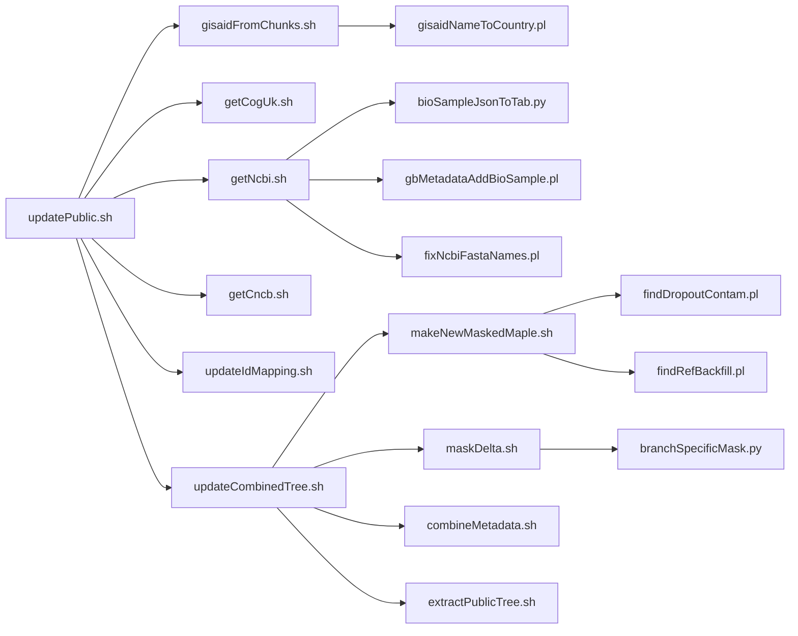

# Scripts Reference

The [ucscgenomebrowser/kent](https://github.com/ucscGenomeBrowser/kent) repository's subdirectory
[src/hg/utils/otto/sarscov2phylo/](https://github.com/ucscGenomeBrowser/kent/blob/master/src/hg/utils/otto/sarscov2phylo)
contains many scripts comprising the daily update pipeline for the SARS-CoV-2 
tree and metadata.  (Some scripts are dead code from earlier phases
of the pandemic that haven't been cleaned up; active scripts are described here.)
The top-level script that drives the daily build is 
[updatePublic.sh](#updatepublicsh) — the name is a bit of a
misnomer, since it updates both the combined GISAID + public tree and the public-only tree.



---


## [`updatePublic.sh`](https://github.com/ucscGenomeBrowser/kent/blob/master/src/hg/utils/otto/sarscov2phylo/updatePublic.sh)

**Purpose:** Fetch sequences and metadata from all sources, deduplicate and map IDs, update trees

**Called by:** cron script

**Calls:** [gisaidFromChunks.sh](scripts.md#gisaidfromchunkssh),
[getCogUk.sh](scripts.md#getcoguksh),
[getNcbi.sh](scripts.md#getncbish),
[getCncb.sh](scripts.md#getcncbsh),
TODO

**Usage:**

```bash
updatePublic.sh /path/to/problematic_sites_sarsCov2.vcf
```

**Notes:** This is the top-level script that drives all others.
`problematic_sites_sarsCov2.vcf` comes from
[https://github.com/W-L/ProblematicSites_SARS-CoV2/blob/master/problematic_sites_sarsCov2.vcf](https://github.com/W-L/ProblematicSites_SARS-CoV2/blob/master/problematic_sites_sarsCov2.vcf)

---


## [`util.sh`](https://github.com/ucscGenomeBrowser/kent/blob/master/src/hg/utils/otto/sarscov2phylo/util.sh)

**Purpose:** define utility functions for use by other scripts

**Called by:** most of the following.sh scripts (sourced not called)

**Usage:**

```bash
source /path/to/kent/src/hg/utils/otto/sarscov2phylo/util.sh
```

**Notes:** Defines `xcat`, `fastaNames`, `fastaSeqCount`, `cleanGenbank`, `cleanCncb`,
and `vcfSamples` as bash functions.
Those commands may be useful when debugging or experimenting on the command line, so you may 
want to source util.sh in your ~/.bashrc.

---


## [`gisaidFromChunks.sh`](https://github.com/ucscGenomeBrowser/kent/blob/master/src/hg/utils/otto/sarscov2phylo/gisaidFromChunks.sh)

**Purpose:** Concatenate files corresponding to "chunks" of GISAID (numeric ranges of EPI_ISL_
IDs) into comprehensive FASTA and metadata files

**Called by:** [updatePublic.sh](scripts.md#updatepublicsh)

**Calls:** [gisaidNameToCountry.pl](scripts.md#gisaidnametocountrypl)

**Usage:**

```bash
gisaidFromChunks.sh
```

**Notes:** Follows Nextstrain's convention of removing spaces from names.
Mimics columns of the Nextstrain-processed metadata that was once available for download
from the GISAID website.
Also removes initial `hCo[vV]-19/` from sequence names and removes `'` and `,` characters.  
Makes additional FASTA file with only the country/isolate/year names (omitting the
|EPI_ISL_...|date parts), to be used as input for updateIdMapping.sh, which is inefficient
because the fasta is very large.
Invokes `make` in the directory with the "chunks" downloaded from the GISAID website.
That makefile runs pangolin and nextclade on newly downloaded sequence chunks.

---


## [`gisaidNameToCountry.pl`](https://github.com/ucscGenomeBrowser/kent/blob/master/src/hg/utils/otto/sarscov2phylo/gisaidNameToCountry.pl)

**Purpose:** GISAID treated each province of China as a country for SARS-CoV-2 and allowed some
abbreviations and misspellings to slip through; correct those.
Also restore spaces in country names when stripped out.

**Called by:** [gisaidFromChunks.sh]()

**Usage:**

```bash
<pipe GISAID sequence names> | gisaidNameToCountry.pl | sort -u > nameCountry.tsv
```

**Notes:** Perl because it was my habitual string-processing language and it's fast with strings.

---


## [`getCogUk.sh`](https://github.com/ucscGenomeBrowser/kent/blob/master/src/hg/utils/otto/sarscov2phylo/getCogUk.sh)

**Purpose:** Fetch sequences and metadata from COG-UK S3 folder.

**Called by:** [updatePublic.sh](scripts.md#updatepublicsh)

**Usage:**

```bash
getCogUk.sh
```

**Notes:** COG-UK stopped updating the files after 2026-02-08, but they're still there so the
script doesn't fail.
Continuing to run it is a bit wasteful.
Runs nextclade but not pangolin because COG-UK always ran the latest version of pangolin.
My favorite data source to work with: a FASTA file and a metadata file, nothing requiring
tweaks or normalization.

---


## [`getNcbi.sh`](https://github.com/ucscGenomeBrowser/kent/blob/master/src/hg/utils/otto/sarscov2phylo/getNcbi.sh)

**Purpose:** Fetch sequences and metadata from NCBI using datasets command.

**Called by:** [updatePublic.sh](scripts.md#updatepublicsh)

**Calls:** [bioSampleJsonToTab.py](scripts.md#biosamplejsontotabpy),
[gbMetadataAddBioSample.pl](scripts.md#gbmetadataaddbiosamplepl),
[fixNcbiFastaNames.pl](scripts.md#fixncbifastanamespl)

**Usage:**

```bash
getNcbi.sh
```

**Notes:** Extra work is required to get useful isolate names because for GenBank submissions,
the isolate name tends to be embedded in a verbose title, while for ENA submissions, the isolate
name cannot appear in the title and must be linked in from BioSample.

A `jq` one-liner is sufficient to extract most basic metadata from
ncbi_dataset/data/data_report.jsonl but extracting the right pieces from
ncbi_dataset/data/biosample_report.jsonl is more complicated,
hence the need for bioSampleJsonToTab.py.

Ignore the old cruft script bioSampleTextToTab.pl which was replaced by bioSampleJsonToTab.py
when biosample_report.jsonl was added to datasets output; before that point, there was some
very slow and error-prone eutils fetching of BioSample text via old cruft bioSample*.sh scripts.

This runs pangolin and nextclade on new sequences.

---


## [`bioSampleJsonToTab.py`](https://github.com/ucscGenomeBrowser/kent/blob/master/src/hg/utils/otto/sarscov2phylo/bioSampleJsonToTab.py)

**Purpose:** Extract isolate names and other metadata from BioSample JSON in NCBI datasets output.

**Called by:** [getNcbi.sh](scripts.md#getncbish)

**Usage:**

```bash
bioSampleJsonToTab.py ncbi_dataset/data/biosample_report.jsonl | uniq > gb.bioSample.tab
```

**Notes:** Record fields and attributes were used inconsistently by different labs so there are
some heuristics about which potential isolate names look more informative than others.

---


## [`gbMetadataAddBioSample.pl`](https://github.com/ucscGenomeBrowser/kent/blob/master/src/hg/utils/otto/sarscov2phylo/gbMetadataAddBioSample.pl)

**Purpose:** Add isolate name and collection date from BioSample when missing from metadata
extracted from data_report.jsonl.

**Called by:** [getNcbi.sh](scripts.md#getncbish)

**Usage:**

```bash
gbMetadataAddBioSample.pl gb.bioSample.tab ncbi_dataset.tsv > ncbi_dataset.plusBioSample.tsv
```

**Notes:** gb.bioSample.tab is the output of 
[bioSampleJsonToTab.py](scripts.md#biosamplejsontotabpy).
ncbi_dataset.tsv is the output of a `jq` one-liner in
[getNcbi.sh](scripts.md#getncbish)

---


## [`fixNcbiFastaNames.pl`](https://github.com/ucscGenomeBrowser/kent/blob/master/src/hg/utils/otto/sarscov2phylo/fixNcbiFastaNames.pl)

**Purpose:** If a good isolate name could not be extracted from the NCBI Datasets FASTA header,
but could be extracted from metadata, then swap in the name from metadata.

**Called by:** [getNcbi.sh](scripts.md#getncbish)

**Usage:**

```bash
cleanGenbank < ncbi_dataset/data/genomic.fna \
| fixNcbiFastaNames.pl ncbi_dataset.plusBioSample.tsv > genbank.maybeDups.fa
```

**Notes:** cleanGenbank is a bash function defined in [util.sh](scripts.md#utilsh).

---


## [`getCncb.sh`](https://github.com/ucscGenomeBrowser/kent/blob/master/src/hg/utils/otto/sarscov2phylo/getCncb.sh)

**Purpose:** Fetch sequences and metadata from CNCB using CNCB's API.

**Called by:** [updatePublic.sh](scripts.md#updatepublicsh)

**Usage:**

```bash
getCncb.sh
```

**Notes:** Yes, the API really is to get one FASTA sequence at a time.
Fortunately on most days there are not an excessive number of new sequences to fetch,
but there have been a couple days on which fetching one sequence at a time with conservative
rate limiting took quite a while.
This runs pangolin and nextclade on new sequences.

---


## [`updateIdMapping.sh`](https://github.com/ucscGenomeBrowser/kent/blob/master/src/hg/utils/otto/sarscov2phylo/updateIdMapping.sh)

**Purpose:** Map IDs of sequences submitted to both GISAID and public repositories (INSDC, COG-UK, CNCB)

**Called by:** [updatePublic.sh](scripts.md#updatepublicsh)

**Usage:**

```bash
today=$(date +%F)
updateIdMapping.sh \
              $gisaidDir/metadata_batch_$today.tsv.gz $gisaidDir/sequences_batch_$today.fa.xz
```

**Notes:** Input files are generated by [gisaidFromChunks.sh](scripts.md#gisaidfromchunkssh).
Most of the work of ID-mapping is performed by scripts in a local (private to UCSC, not on GitHub)
repository authored by a colleague of mine who is so afraid of GISAID that they don't want to
publish their ID-mapping scripts.  Those scripts are available upon reasonable request.
This script also adds mapped public IDs to the gisaid metadata file.

---


## [`updateCombinedTree.sh`](https://github.com/ucscGenomeBrowser/kent/blob/master/src/hg/utils/otto/sarscov2phylo/updateCombinedTree.sh)

**Purpose:** Identify sequences that are not yet in the tree, filter and attempt to add them
using usher-sampled, run matOptimize, annotate Nextstrain clades and Pango lineages on tree,
combine metadata from all sources, extract public-sequence-only subtree, publish files.

**Called by:** [updatePublic.sh](scripts.md#updatepublicsh)

**Calls:** [makeNewMaskedMaple.sh](scripts.md#makenewmaskedmaplesh),
[maskDelta.sh](scripts.md#maskdeltash),
[combineMetadata.sh](scripts.md#combinemetadatash),
[extractPublicTree.sh](scripts.md#extractpublictreesh)

**Usage:**

```bash
today=$(date +%F)
prevDate=$(date -d yesterday +%F)
updateCombinedTree.sh $prevDate $today $problematicSitesVcf [$baseProtobuf]
```

**Notes:** This is the heart of the daily update, where usher-sampled and matOptimize run, but
also many other steps: filtering and annotation with matUtils, summary/description/viz files,
subtree extraction, staging of files for download and (dev.)usher.bio usage.

The `$problematicSitesVcf` input is passed down from [updatePublic.sh](scripts.md#updatepublicsh).
The `$baseProtobuf` input is optional; the default behavior is to use the previous day's tree,
but `$baseProtobuf` will be used instead if provided.
That provides a way to start with a tree from more than one day ago when there has been a
multi-day interruption in the daily update process.

To facilitate reruns after stoppage/breakage/manual intervention in the most common places,
this skips calling [makeNewMaskedMaple.sh](scripts.md#makenewmaskedmaplesh) if its output file
new.masked.mpl.gz already exists,
and this skips calling the usher-sampled / masking / matOptimize / filtering critical section
if gisaidAndPublic.$today.masked.pb.gz already exists.

---


## [`makeNewMaskedMaple.sh`](https://github.com/ucscGenomeBrowser/kent/blob/master/src/hg/utils/otto/sarscov2phylo/makeNewMaskedMaple.sh)

**Purpose:** Identify sequences not yet in the tree, filter for quality, make MAPLE/"diff"-formatted input for usher-sampled.

**Called by:** [updateCombinedTree.sh](scripts.md#updatecombinedtreesh)

**Calls:** [findDropoutContam.pl](scripts.md#finddropoutcontampl),
[findRefBackfill.pl](scripts.md#findrefbackfillpl)

**Usage:**

```bash
makeNewMaskedMaple.sh $prevDate $today $problematicSitesVcf [$baseProtobuf]
```

**Notes:** The `$problematicSitesVcf` input is passed down from
[updateCombinedTree.sh](scripts.md#updatecombinedtreesh).
The `$baseProtobuf` input is optional; if provided, it will be used as the starting tree.
Otherwise, if a file with a special `.useMe` in its name exists,
i.e. `$ottoDir/$prevDate/gisaidAndPublic.$prevDate.masked.useMe.pb.gz`,
then it will be used (providing a mechanism to pass in a pruned and re-optimized version
of the tree to use as a starting point, see all of the `notes/*_treeWork.txt` files in this
repository).
Otherwise, the previous day's tree, `$ottoDir/$prevDate/gisaidAndPublic.$prevDate.masked.pb.gz`,
will be used as the starting tree.

Before comparing the current set of sequences to the set of sequences in the tree, this script
looks for sequences that are now duplicated in the tree because a mapping from GISAID to a public
sequence has become available, or because a COG-UK sequence has been added to GenBank, and
arbitrarily removes one of each pair of duplicates.
It also renames all sequences in the tree using the latest metadata in case there have been any
metadata changes that affect the sequence names.

The filtering implemented by [findDropoutContam.pl](scripts.md#finddropoutcontampl) and
[findRefBackfill.pl](scripts.md#findrefbackfillpl) often excludes potential recombinant sequences
that the Pango lineage hunters find interesting, so there are two files that can exclude
sequences from filtering:

* includeRecombinants.tsv (kept in the same directory as all of these scripts), which I manually
  update when lineage hunters ask me to not filter out specific sequences
* [sars-cov-2-variants/lineage-proposals recombinants.tsv](https://raw.githubusercontent.com/sars-cov-2-variants/lineage-proposals/main/recombinants.tsv), directly maintained by lineage hunters

---


## [`findDropoutContam.pl`](https://github.com/ucscGenomeBrowser/kent/blob/master/src/hg/utils/otto/sarscov2phylo/findDropoutContam.pl)

**Purpose:** Use nextclade TSV output to identify sequences assigned to a pre-Omicron clade but
with with at least 5 Omicron substitutions, or assigned to an Omicron clade but with at least 5
reversions.

**Called by:** [makeNewMaskedMaple.sh](scripts.md#makenewmaskedmaplesh)

**Usage:**

```bash
zcat $source/nextclade.full.tsv.gz | findDropoutContam.pl > $source.dropoutContam
```

**Notes:** This is run on nextclade TSV from each source (GISAID, NCBI, COG-UK, CNCB).
It was added in the early Omicron days when there were lots of problems with incomplete or
contaminated Omicron sequences.

---


## [`findRefBackfill.pl`](https://github.com/ucscGenomeBrowser/kent/blob/master/src/hg/utils/otto/sarscov2phylo/findRefBackfill.pl)

**Purpose:** Use nextclade TSV output to identify sequences with suspiciously few substitutions,
implying that missing sequence has been backfilled with reference sequence.

**Called by:** [makeNewMaskedMaple.sh](scripts.md#makenewmaskedmaplesh)

**Usage:**

```bash
zcat $source/nextclade.full.tsv.gz | cut -f 2,11 \
| <transform to accession, join with metadata to get date if necessary> \
| findRefBackfill.pl > $source.refBackfill
```

**Notes:** A sequence is filtered out if its number of substitutions relative to the reference is
less than `($epiMonth - 2) * 0.75` where `$epiMonth` zero is December 2019.  If sample collection
date is missing, then January is assumed to err on the side of not throwing out sequences from
early in the year.
This is run on nextclade TSV from each source (GISAID, NCBI, COG-UK, CNCB).  It was added in the
early Omicron days when there were lots of problems with incomplete sequences having missing parts
filled in with reference sequence.

---


## [`maskDelta.sh`](https://github.com/ucscGenomeBrowser/kent/blob/master/src/hg/utils/otto/sarscov2phylo/maskDelta.sh)

**Purpose:** Call branchSpecificMask.py to mask specific sites or reversions on specific branches.

**Called by:** [updateCombinedTree.sh](scripts.md#updatecombinedtreesh)

**Calls:** [branchSpecificMask.py](scripts.md#branchspecificmaskpy)

**Usage:**

```bash
maskDelta.sh merged.pb.gz merged.deltaMasked.pb.gz
```

**Notes:** The script is now just a wrapper on branchSpecificMask.py, but it started out as a bash
script invoking `matUtils mask --mask-mutations` on the Delta branch because amplicon dropout
caused problems at a lot of sites during the early Delta days, and branch-specific masking was
developed in response.

---


## [`branchSpecificMask.py`](https://github.com/ucscGenomeBrowser/kent/blob/master/src/hg/utils/otto/sarscov2phylo/branchSpecificMask.py)

**Purpose:** Parse a YAML description of specific branches where specific sites, ranges or reversions should be masked, make an input file for `matUtils mask --mask-mutations` and run it.

**Called by:** [maskDelta.sh](scripts.md#maskdeltash)

**Usage:**

```bash
branchSpecificMask.py $treeInPb branchSpecificMask.yml $treeOutPb
```

**Notes:** [branchSpecificMask.yml](https://github.com/ucscGenomeBrowser/kent/blob/master/src/hg/utils/otto/sarscov2phylo/branchSpecificMask.yml)
is in the same directory as all of these scripts.
Hopefully its format is self-explanatory but here are some tips.
The use of Pango lineages for branch labels is only for descriptive purposes; tree annotations
are not used to find branches.  Instead, the mandatory keyword `representative` is used to find
the parental node of a specific sequence that must be already in the tree, and the optional
keyword `representativeBacktrack` specifies the number of additional hops back to ancestral nodes
when the desired node does not have a direct descendant sequence to use as representative.
Sometimes the specified node is not exactly the same as the start of the Pango lineage used as
branch label, but they're usually the same.

The `exclusions` keyword was added relatively late (December 2025) so that some descendants of a
branch could be exempted from the masking, to allow real reversions to be represented in the tree
and in Pango lineage definitions in
[pango.clade-mutations.tsv](https://github.com/ucscGenomeBrowser/kent/blob/master/src/hg/utils/otto/sarscov2phylo/pango.clade-mutations.tsv).
There are many more cases, especially in recombinant lineages where several reversions are often
an important part of the lineage definition, where exclusions could have been used.

See the doc section on [Branch-specific masking](../manual-curation/build-fixes.md#branch-specific-masking) for more info.

---


## [`combineMetadata.sh`](https://github.com/ucscGenomeBrowser/kent/blob/master/src/hg/utils/otto/sarscov2phylo/combineMetadata.sh)

**Purpose:** Combine metadata from GISAID, NCBI, COG-UK and CNCB into a single TSV file.

**Called by:** [updateCombinedTree.sh](scripts.md#updatecombinedtreesh)

**Usage:**

```bash
combineMetadata.sh $prevDate $today
```

**Notes:** csv-tk is used in one place where `grep -Fwf ...` hit a performance wall.
The rest is very Unix-y and could be rewritten to make better use of csv-tk.

---


## [`extractPublicTree.sh`](https://github.com/ucscGenomeBrowser/kent/blob/master/src/hg/utils/otto/sarscov2phylo/extractPublicTree.sh)

**Purpose:** Extract the public-sequence-only subtree of the full tree, make download files, and stage for download and (dev.)usher.bio.

**Called by:** [updateCombinedTree.sh](scripts.md#updatecombinedtreesh)

**Usage:**

```bash
extractPublicTree.sh $today $prevDate
```

**Notes:** This re-annotates Nextstrain clades and Pango lineages on the subtree because some
lineage start nodes are modified when removing GISAID sequences from the full tree.
A fair number of small lineages have no non-GISAID sequences, so they can't be annotated,
and the annotation process is slowed down by trying all the lineages even though some aren't
possible.
