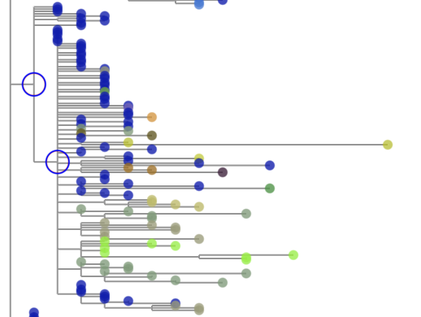
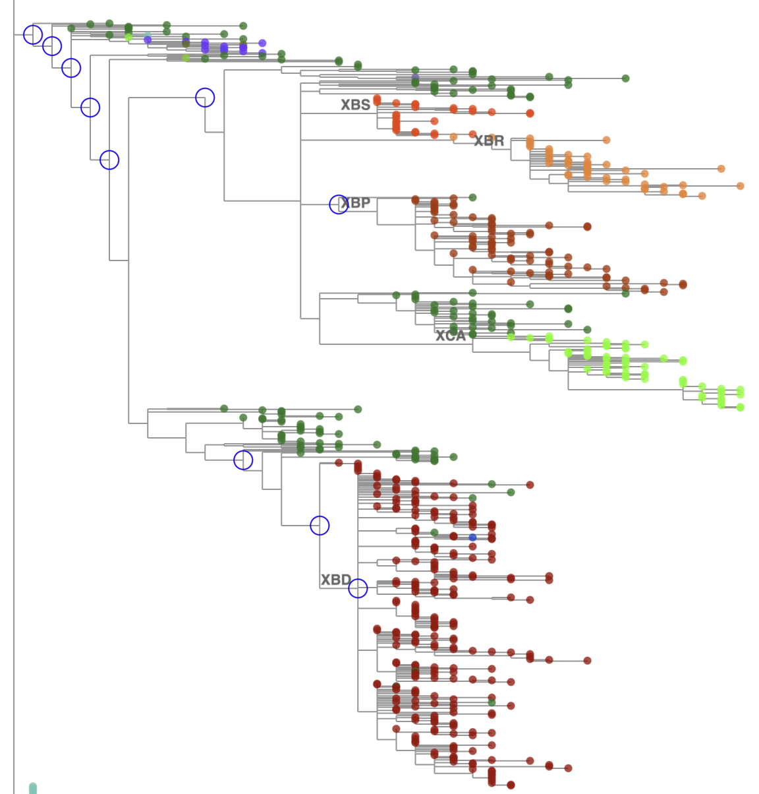
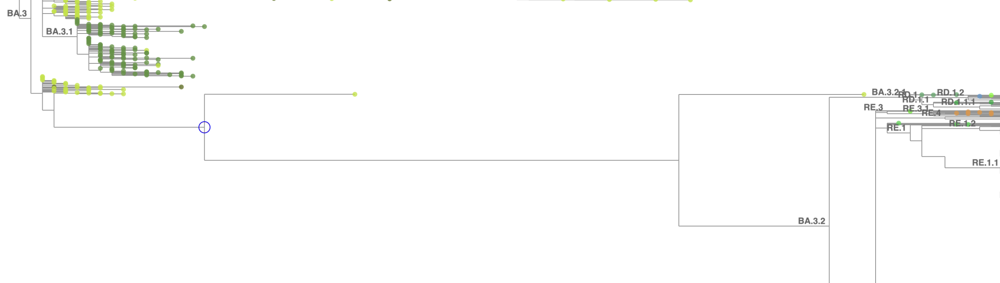
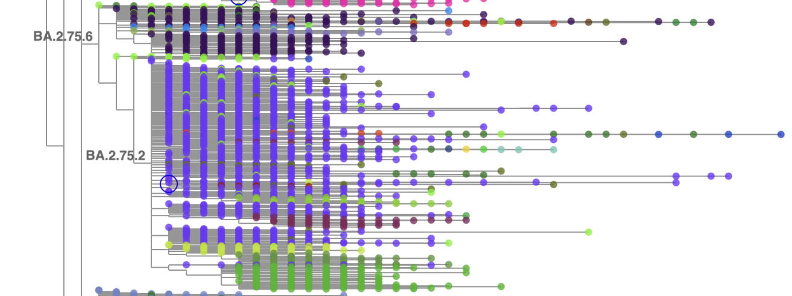
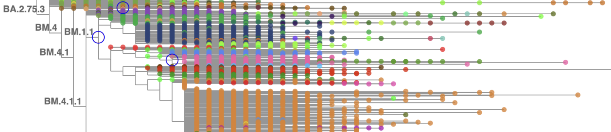

# Inspecting the Tree in Taxonium

## Getting started with Taxonium

### Installing the Taxonium app

The web version of taxonium may run into memory limits when trying to display very large trees
such as the SARS-CoV-2 tree.  Instead, use the local app version of Taxonium.
Installation instructions are [here](https://docs.taxonium.org/en/latest/app.html#installing).
**MacOS users**, pay special attention to the Note with the `xattr` command.

### Downloading the tree file for viewing

The daily update pipeline generates a Taxonium file for the full tree.  To download that file
to your computer for viewing, assuming you have SSH access to hgwdev (or another
internet-accessible machine with access to the filesystem on which the pipeline runs),
you can use `scp` like this (after today's build has completed):
```bash
today=$(date +%F)
scp hgwdev:/path/to/sarscov2phylo/$today/gisaidAndPublic.$today.masked.taxonium.jsonl.gz .
```

### Loading the tree

Start the Taxonium app.  Either drag the downloaded .jsonl.gz file onto the center window, or
click the 'Open File' button and select the file.  Taxonium will get to work digesting the file
with progress messages, and then display the tree.

I always tweak a few settings after starting Taxonium:

1. Click the settings (gear) icon along the bottom of the tree image pane.
Check the checkbox by "Nucleotide" to see nucleotide substitutions (not only Amino acid).
Click into the Appearance tab and change "Max clade labels to show" from its default 10 to 100.
Click somewhere outside of the Settings window to close it.
1. Click the "Zoom in horizontally" button (magnifying glass with left-right arrow) until the
horizontal width of a single substitution looks good to you (for me, with the SARS-CoV-2 tree,
that's 3 clicks).
1. Change the default search from Name to something else and then change it back again, so that
the checkboxes labeled 'x' (exact match) and 'm' (multiple matches) appear.  Check the 'm'
checkbox so that you can paste in collections of complete sequence names (generally extracted
by commands/pipes that include greps in the build output file `samples.$today`),
for example to highlight and zoom to a newly designated lineage.
1. I also click 'Add a new search' and choose Revertant, to highlight branches with reversions.
The default is 'with at least [ 0 ] descendants' which applies to so many branches and sequences
that it's a little overwhelming, so I change it to something like 4 when annotating new lineages
or 100 when looking for reversions causing major trouble in a large lineage.

## Cascading reversion branches

It's very common for a new variant that sweeps to prominence to have a significant number of
new mutations, especially in Spike, and unfortunately it's common for those to interfere
with the binding of primers in some commonly used amplicon scheme, causing amplicon dropout.
When that happens, and especially when there is low-level contamination during sequencing
by some other lineage that does not have the new mutations, it is common for reference bases
to be called in the consensus sequence in the affected amplicon(s) instead of the new mutations
that the virus most likely has.  This happened in Delta especially at position 21987 (but others
as well), and in every wave of Omicron variants.

When multiple sequences have apparent reversions to the reference base at the same position,
maximum parsimony groups them together and forms branches with reversions, often attached to the
main polytomy of a large lineage.
When a sequence is affected by one reversion, it's often affected by more than one reversion,
so branches with cascading reversions can form.
The significant parsimony improvement of lumping sequences together that share multiple reversions
tends to attract in sequences that have the defining mutations of sublineages, causing the
multiple-reversion branches to form little microcosms of the parent lineage.
For example, a multiple-reversion branch in KP.3.1.1 might attract sequences that actually
belong to child lineages MC.2, MC.11, MC. 16, MC.35 and others.
Selecting 'Color by: [ Pangolin lineage ]' in Taxonium shows that the branch has child branches
of many colors.
We might call that branch a "mini-KP.3.1.1".
(Thus references to "mini-Delta" etc. in old notes.)

<figure markdown="1">

<figcaption>A cascading reversion branch on the KP.3.1.1 polytomy that forms a "mini-KP.3.1.1" -
note the large blue circles from the Revertant search, and the child branches with different
Pango lineage colors
</figcaption>
</figure>

If many sequences of a child lineage have multiple reversions in common, then the child lineage
branch of the multi-reversion might start attracting sequences that don't have the reversions
away from the real lineage branch (on the parent polytomy, without the reversions).

The usual way of correcting trouble caused by multi-reversion branches is to add an entry for
the parent lineage in 
[branchSpecificMask.yml](https://github.com/ucscGenomeBrowser/kent/blob/master/src/hg/utils/otto/sarscov2phylo/branchSpecificMask.yml)
(see [Branch-specific masking](build-fixes.md#branch-specific-masking))
if it doesn't already have one,
and add the reversions that are causing trouble to its `reversions` list.
After that masking is applied in the next daily build, matOptimize will move the child lineage
branches from the no-longer-reverted branch into the proper child lineage branches on the parent's main polytomy.

<figure markdown="1">

<figcaption>At first glance this looks like an awful reversion cascade and mini-something -
but see how the differently colored descendant branches are labeled.
They're recombinants!  (X* lineages)
The reversions are necessary for representing them in the tree.
Don't prune this branch, and try to avoid masking those reversions unless they're wreaking havoc
elsewhere.
</figcaption>
</figure>

## Incomplete sequences around the base of major lineages

Some sequences have so much amplicon dropout and backfilling with reference sequence that they
are plain old incomplete despite having a near-full length.
Other sequences are chimeras from mixed infection or have widespread contamination.
Such sequences often are placed around the base of a major lineage because, from a maximum
parsimony point of view, they might look like intermediates between the closest identifiable
ancestor branch and the new variant.

<figure markdown="1">

<figcaption>There should be one long branch to BA.3.2 which emerged in late 2024,
but two dubious sequences from 2026 break it up.
</figcaption>
</figure>

If such sequences are causing confusion or alarm in users of the tree, or attracting
better sequences away from better placements,
then it may be worth the effort to prune the sequences from the tree
(see [Pruning and re-optimization](manual-fixes.md#pruning-and-re-optimization))
and permanently exclude them from the build
(see [Manually excluding sequences](build-fixes.md#manually-excluding-sequences)).

## Lineages out of order

BA.2.75 was plagued by not only sequence quality issues, but also recurring Spike mutations
that maximum parsimony tended to lump together in ways that differed from human lineage hunters'
determinations of the true branching structure and the order in which mutations occurred.
For example, BA.2.75.2 was designated early on with four defining mutations relative to BA.2.75
including S:R346T (G22599C).
Later, BA.2.75.6 was defined with only one defining mutation relative to BA.2.75: S:R346T
(G22599C).
The maximum parsimony interpretation is to make BA.2.75.6 a child of BA.2.75 (fine) and then to
make BA.2.75.2 a descendant of BA.2.75.6 because of the shared G22599C - which contradicts the
Pango hierarchy (BA.2.75.2 is a child of BA.2.75 not BA.2.75.6 which is its sibling).

<figure markdown="1">

<figcaption>BA.2.75.2 is a sublineage of BA.2.75, not of BA.2.75.6.
But maximum parsimony places BA.2.75.2 as a descendant of BA.2.75.6 because the two sibling
lineages share a defining mutation.
</figcaption>
</figure>

Forcing a move of the BA.2.75.2 branch wouldn't fix the problem because matOptimize would simply
move it back to the more parsimonious (though incorrect) placement in the next daily build.
Designating and annotating Pango lineages is the best way to clarify the situation.

An even more complicated situation arose with the BM.* sublineages of BA.2.75.3.
BM.1.1 is placed as a child of BM.4.1.1, with a reversion, because BM.1.1's defining mutations
are the same as BM.4.1's and BM.4.1.1's (but it's missing the BM.4 mutation, thus the reversion).
BM.1 could have been placed as a child-with-reversion of BM.1.1 - but instead it was placed
as a child of BA.2.75.7 because of its shared S:F486S (T23019C).

<figure markdown="1">

<figcaption>BM.1.1 is a sublineage of BM.1, but is placed as child of BM.4.1.1, because of
multiple shared defining mutations.
</figcaption>
</figure>

Again, due to using maximum parsimony and reoptimizing daily, there's no permanent way to enforce
the desired branch structure. 
Designating and annotating Pango lineages at least leads to the correct lineage assignments for
sequences.
